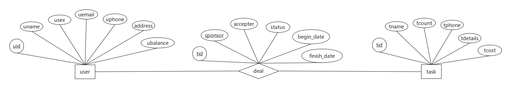

## 数据库设计

### 用户user

- uid
    - 用户id，即学号，作为主键，是用户唯一标识
- uname
    - 用户姓名/昵称
- usex
    - 用户性别，某些任务可能限定性别
- uemail
    - 用户邮箱，可验证用
- uphone
    - 用户联系方式
- address
    - 用户地址
- ubalance
    - 用户余额

### 任务task

- tid
    - 任务id，作为主键，是任务唯一标识
- tname
    - 任务名称
- tcount
    - 任务数量，任务的接受者可能一个或多个
- tphone
    - 任务发起者的联系方式
- tdetails
    - 任务详情
- tcost
    - 任务的花费

### 交易deal

- tid
    - 交易中的任务id，主键之一
- sponsor
    - 交易的发起者，主键之一
- accepter
    - 交易的接受者
- status
    - 交易的状态，如未接受、已接受、已完成
- begin_time
    - 交易起始时间
- finish_time
    - 交易完成时间
