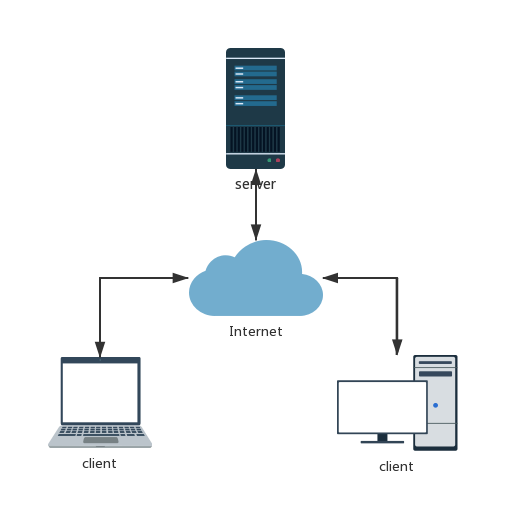

# 软件设计文档
## 目录
- [开发规划](##开发规划)
  - [开发人员](###开发人员)
  - [开发计划](###开发计划)
  - [开发环境和工具](###开发环境和工具)
  - [开发规范](###开发规范)

- [总体设计数据结构](##总体设计数据结构)
  - [概念术语描述](###概念术语描述)
  - [基本设计描述](###基本设计描述)
    - 系统总体逻辑结构图
	- 系统部署结构图
  - [主要界面流程描述](###主要界面流程描述)
	- 登陆注册功能界面流程
    - 发布任务功能界面流程
	- 接受任务功能界面流程
  - [模块列表](###模块列表)
- [数据结构（数据库）](##数据结构)
- [接口规范](##接口规范)
  - [<模块1 xxxxAPI>](###<模块1 xxxxAPI>)
	- 接口1——
	- 接口2——
  - [<模块2 xxxxAPI>](###<模块2 xxxxAPI>)
  - [<模块3 xxxxAPI>](###[<模块3 xxxxAPI>](###))
- [模块设计](##模块设计)
  - [模块设计描述](###模块设计描述)
  - [模块界面描述](###模块界面描述)
- [附录](##附录)
  - [第三方组件](###第三方组件)
  - [参考资料](###参考资料)
  - [附加文档](###附加文档)

## 开发规划
### 开发人员
|学号  姓名 英文名|角色|
|:--:|:--:|
|16340251 谢冰澄 Beatrix | PM、UI设计师|
|15352307 汤伟杰 twj15352307|QA工程师，产品经理|
|16340184 邱婷 AaronCyril|后端程序员|
|16340254 谢济锴 Jack|后端设计师，开发经理|
|16340263 许海晨 Andy|前端程序员|
|16340262 徐艺 Eva|前端程序员|
|16340223 王思诚 wsc16340223|后端程序员|
|16340104 蓝华琳 RinHuA|DevOps工程师|

### 开发计划表
- 前端

|功能|预计开始时间|预计工作日|
|:--:|:--:|:--:|
|确定页面功能|第10周|2|
|确定页面分布|第11周|3|
|草稿初定|第12周|7|
|html 与 css|第13周|7|
|js | 第14周|7|

- 后端

|功能|预计开始时间|预计工作日|
|:--:|:--:|:--:|
|确定架构|第10周|7|
||||
||||
||||

### 开发环境和工具

|工具|功能|
|:--:|:--:|
|mySQL|提供数据库服务|
|||

### 开发规范
|文档名称|位置|
|:--:|:--:|
|系统目录规范.md|Document|

## 总体设计
### 概念术语描述
### 基本设计描述
- 设计思路
  - 在本次实验中，我们从业务和功能出发，应用了客户端-服务端的传统相应模式，部署web页面。
- 系统总体逻辑结构图
  - 
  
- 系统部署结构图
  - 
### 主要界面流程描述
- 登陆注册功能界面流程

<table>
    <tr>
        <td >
 用例图 
</td>
        <td >
 活动图 
</td>
    </tr>
</table>

- 发布任务功能界面流程

<table>
    <tr>
        <td >
 用例图 
</td>
        <td >
 活动图 
</td>
    </tr>
</table>

- 接受任务功能界面流程

<table>
    <tr>
        <td >
 用例图 
</td>
        <td >
 活动图 
</td>
    </tr>
</table>

## 数据结构
- 数据库关系列表
|关系（表名）|作用|
|:--:|:--:|
|||
|||
[<附SQL数据库结构定义文档>]
## 接口规范
### <模块1 xxxxAPI>
- 模块共功能简要介绍
  - 
- 接口1——(函数（参数1，参数2）)
  - 参数1 描述 
  - 参数2 描述
- 接口2——（类似地写）
- 
### <模块2 xxxxAPI>
### <模块3 xxxxAPI>

### <数据库API>
- 定义数据库存储过程接口
- 接口1——(函数（参数1，参数2）)
  - 参数1 描述 
  - 参数2 描述
  
## 模块设计

## 附录
### 第三方组件
|组件名|版本|用途|
|:--:|:--:|:--:|
||||
||||

### 参考资料
- 
### 附加文档
|文档名|所属文件名|描述|
|:--:|:--:|:--:|
|||数据库定义脚本|
||||
