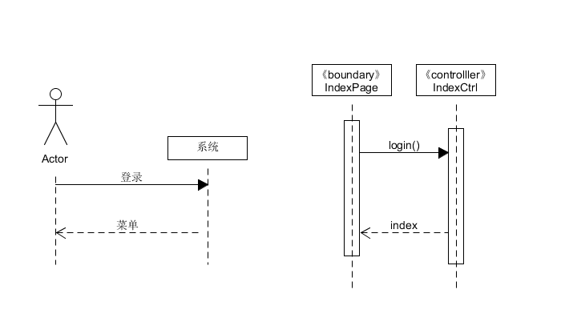
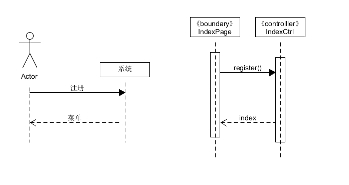
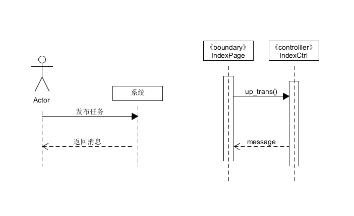
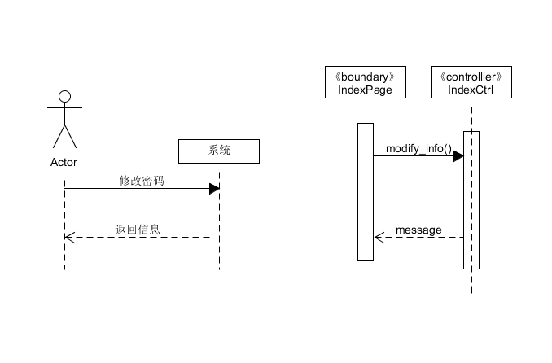
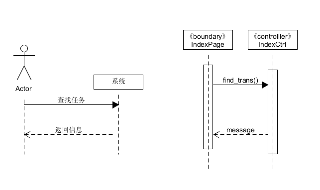

# 基本功能

 1. 登录
 2. 注册
 3. 发布任务
 4. 修改密码/邮箱
 5. 查找任务
  
  
学生可以在我们的网站上获取相关任务，完成任务获得积分，再将积分提取为现金，从而达到挣闲钱的目的。
# 系统顺序图

### 1.登录
用户进行登录

### 2.注册

注册用户

### 3.发布任务
用户进入个人页面发布任务

### 4.修改密码/邮箱

用户进入个人页面修改密码和邮箱

### 5.查找任务

用户进入个人页面后查找相关任务

