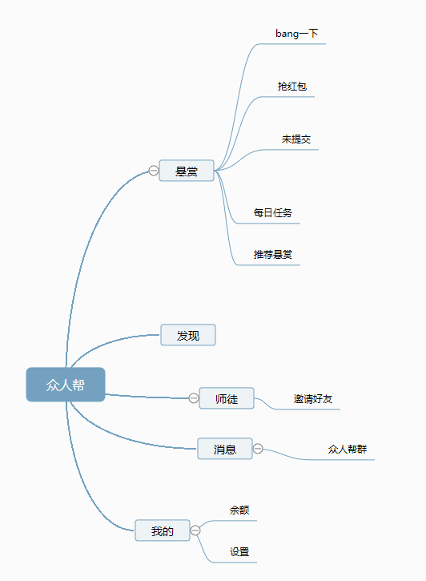

# 前期调研工作汇总
- [竞品调研](#竞品调研)
  - [桔子兼职](#桔子兼职) 
  - [众人帮](#众人帮) 

- [技术调研](#技术调研)
  - [搭建MVC环境](#搭建MVC环境)

  

## 竞品调研

### 桔子兼职
 - by 16340251 Beatrix

*特点*

|观察视角|功能要点|
|:---:|:---:|
|用户管理|账号 密码 手机 支付宝账号 积分（即金桔）|
|财务管理|用户积分（金桔数量）对应可提现额度|
|业务形式|用户依据任务进行文字信息录入获得积分，积分满额度可提现|

*观察者语*：
  - 涉及到资金管理方面的一定注意维护好数据之间的对应，就我目前所学的知识来看应该是要建立好何维护好数据库。
  - 使用满额度提现的方式，并且限定一天只能提现一次可以避免频繁的资金操作，便于管理。
  - 如何确定审核用户已经完成了任务是需要商讨的。
  
### 立应校园服务  
 - by 16340184 AaronCyril
 

*特点*

兼具O2O与C2C众包模式，用户可以发出各种个性化需求任务，自定小费；还可以成为服务者，利用空余的时间参与抢单，赚取报酬；平台采取订单智能推送，高效抢单模式。同时，服务者也可以在平台发布自己的技能服务，供有需求的用户选择购买。通过众包模式实现共享服务。

### 众人帮
 - by 16340263 Andy
 
 
 
 *特点*
 
 |要点|详情|
 |:---:|:---:|
 |用户管理|手机注册、登录、会员|
 |业务种类|打卡、看新闻、问卷、注册APP、关注发布任务者等等|
 |财务管理|积分、提现至支付宝账户、提升等级|
 
## 技术调研

### 搭建MVC环境

 - [参考技术博客--无私分享：从入门到精通ASP.NET MVC】从0开始，一起搭框架、做项目（1）搭建MVC环境 注册区域 ](https://www.cnblogs.com/yuangang/p/5472798.html)
   - （此人的系列博客也有与项目技术相关） 
 - [参考技术博客 -- 使用MVC实现用户登录注册系统—银行管理系统](https://blog.csdn.net/aA518189/article/details/78858323)
