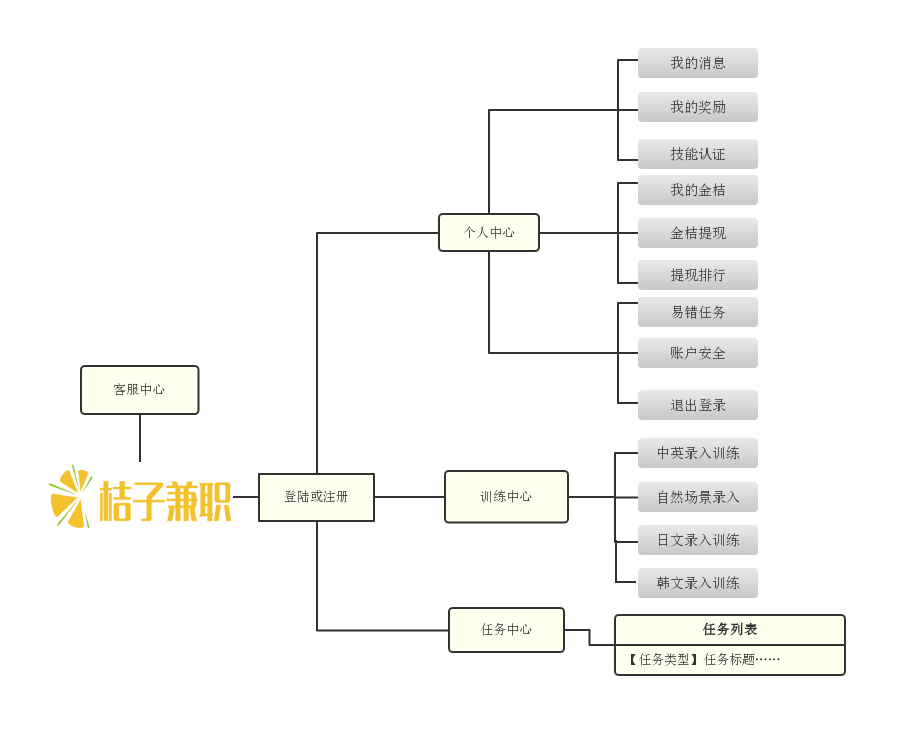

# 前期调研工作汇总
- [竞品调研](#竞品调研)
  - [桔子兼职](#桔子兼职) 

- [技术调研](#技术调研)
  - [搭建MVC环境](#搭建MVC环境)

  

## 竞品调研

### 桔子兼职
 - by 16340251 Beatrix

*特点*

|观察视角|功能要点|
|:---:|:---:|
|用户管理|账号 密码 手机 支付宝账号 积分（即金桔）|
|财务管理|用户积分（金桔数量）对应可提现额度|
|业务形式|用户依据任务进行文字信息录入获得积分，积分满额度可提现|

*观察者语*：
  - 涉及到资金管理方面的一定注意维护好数据之间的对应，就我目前所学的知识来看应该是要建立好何维护好数据库。
  - 使用满额度提现的方式，并且限定一天只能提现一次可以避免频繁的资金操作，便于管理。
  - 如何确定审核用户已经完成了任务是需要商讨的。

## 技术调研

### 搭建MVC环境

 - [参考技术博客--无私分享：从入门到精通ASP.NET MVC】从0开始，一起搭框架、做项目（1）搭建MVC环境 注册区域 ](https://www.cnblogs.com/yuangang/p/5472798.html)
   - （此人的系列博客也有与项目技术相关） 
 - [参考技术博客 -- 使用MVC实现用户登录注册系统—银行管理系统](https://blog.csdn.net/aA518189/article/details/78858323)
